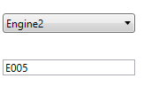

# How to Display the Selected Value from ComboBoxAdv in a TextBox (WPF)
This example demonstrates how to display the selected value from a Syncfusion WPF ComboBoxAdv control in a TextBox. This is useful in scenarios where you need to show the selected key or value in a separate UI element, such as forms or data entry screens.

## Why This Is Useful
- Dynamic UI Updates: Reflect selected values in other controls.
- Data Binding: Keeps UI and data model in sync.
- Better UX: Provides clear feedback to users.

## Key Properties
- **SelectedValuePath**: Specifies the property path used to determine the SelectedValue.
- **SelectedValue**: Represents the value of the selected item based on SelectedValuePath.

## Code Example
**XAML**
```XAML
<syncfusion:ComboBoxAdv Name="comboBox1"
                        Width="150"
                        DisplayMemberPath="Value"
                        ItemsSource="{Binding SelectedEngineTypeCollection}"
                        SelectedValue="{Binding ComboBoxSelectedValue}"
                        SelectedValuePath="Key" />

<TextBox Width="150"
         Margin="30"
         Text="{Binding ComboBoxSelectedValue}" />
```

**C#**
```C#

public partial class MainWindow : Window, INotifyPropertyChanged
{
    public event PropertyChangedEventHandler PropertyChanged;

    private object comboBoxSelectedValue;
    public object ComboBoxSelectedValue
    {
        get => comboBoxSelectedValue;
        set
        {
            comboBoxSelectedValue = value;
            PropertyChanged?.Invoke(this, new PropertyChangedEventArgs(nameof(ComboBoxSelectedValue)));
        }
    }

    public Dictionary<Enum_Type, string> SelectedEngineTypeCollection { get; set; }

    public MainWindow()
    {
        InitializeComponent();
        SelectedEngineTypeCollection = new Dictionary<Enum_Type, string>
        {
            { Enum_Type.E004, GetDescription(Enum_Type.E004) },
            { Enum_Type.E005, GetDescription(Enum_Type.E005) },
            { Enum_Type.E006, GetDescription(Enum_Type.E006) }
        };

        this.DataContext = this;
    }
}
```

## Reference
For more details, refer to the official Syncfusion Knowledge Base: [How-to-display-the-selected-value-from-ComboBox-in-textbox](https://www.syncfusion.com/kb/12198/how-to-display-the-selected-value-from-wpf-comboboxadv-to-textbox)

## Output


